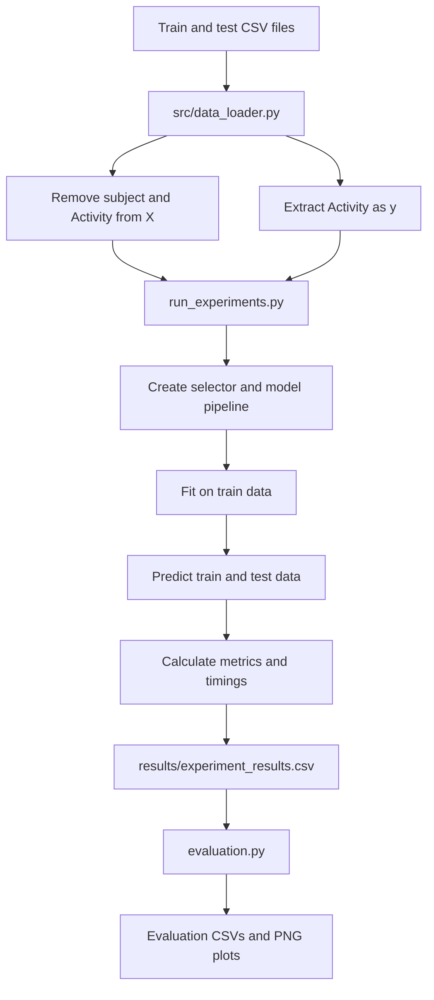

# Human Activity Recognition

Machine-learning project for classifying six human activities from smartphone accelerometer and gyroscope features. The current workflow runs 18 experiments, then creates comparison tables and plots.

## Data

Input files:

```text
dataset/train.csv
dataset/test.csv
```

Each row contains 561 sensor features, `subject`, and the `Activity` target. `subject` is excluded from training. The target classes are `WALKING`, `WALKING_UPSTAIRS`, `WALKING_DOWNSTAIRS`, `SITTING`, `STANDING`, and `LAYING`.

Run commands from the repository root because the loaders use relative paths.

## Workflow



`python main.py` runs the complete workflow: it executes `run_all_experiments()`, saves the 18 rows, and then calls `evaluation()`.

## Experiment configuration

The matrix is defined in `run_experiments.py`:

```text
6 models × 3 feature-condition labels = 18 experiments
```

Models: Logistic Regression, KNN, RBF SVM, Extra Trees, Random Forest, and LDA.

Feature-condition labels: `all_features`, `F-Classif`, and `RFE`.

`N_FEATURES = 350` is passed to every selector by the runner. Therefore, in the current code, `all_features` also selects 350 features with `SelectKBest(f_classif)`; it does not use all 561 raw features. `F-Classif` uses the same selector explicitly. `RFE` uses a balanced 100-tree Random Forest estimator and removes features in steps of 10.

Each model is a scikit-learn `Pipeline`, keeping preprocessing and selection fitted on training data before applying them to test data.

## Recorded results

The latest checked-in results contain 18 rows. The best run is:

```text
Logistic Regression + RFE + 350 features
Test accuracy: 96.23%
```

| Feature condition | Best test accuracy |
|---|---:|
| `RFE` | 96.23% |
| `F-Classif` | 95.52% |
| `all_features` | 95.52% |

Generated outputs:

```text
results/experiment_results.csv
results/evaluation/all_results.csv
results/evaluation/model_comparison.csv
results/evaluation/feature_selection_comparison.csv
results/evaluation/top_experiments.csv
results/evaluation/test_accuracy.png
results/evaluation/train_vs_test_accuracy.png
results/evaluation/training_time.png
```

`results/notebook.ipynb` is a supplementary reporting artifact.

## Repository structure

```text
Capstone_1/
├── architecture/       # Proposal and design documentation
├── dataset/            # train.csv and test.csv
├── results/            # Experiment, evaluation, graph, and notebook outputs
├── src/                # Data loading, selectors, and model factories
├── main.py             # End-to-end entry point
├── run_experiments.py  # Training and experiment result generation
├── evaluation.py       # Result analysis and plot generation
├── requirements.txt
├── HANDOFF.md
└── README.md
```

## Setup and execution

```bash
python -m venv venv
venv\\Scripts\\activate
pip install -r requirements.txt
python main.py
```

To rerun only reporting against the existing experiment CSV:

```bash
python -c "from evaluation import evaluation; evaluation()"
```

Rerunning `main.py` overwrites the experiment CSV and evaluation artifacts.

## Data leakage policy

The test set is used only for final evaluation. Selectors and preprocessing are fitted through each training pipeline using training data, then applied to test data. The source CSVs are not modified.

## Documentation

- [Architecture proposal](architecture/proposal.md)
- [Architecture design](architecture/design.md)
- [Project handoff](HANDOFF.md)
- [Reporting notebook](results/notebook.ipynb)
