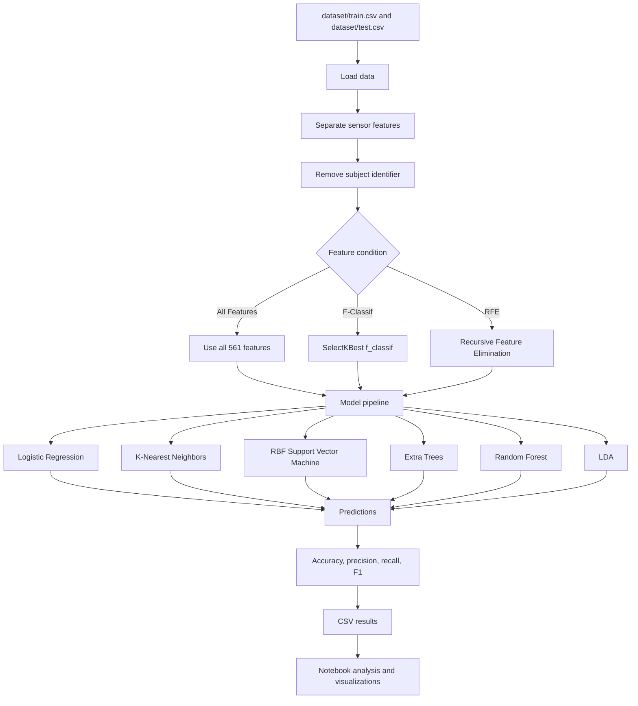
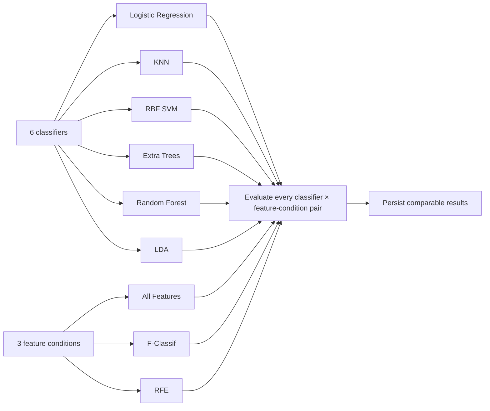

# Human Activity Recognition

Machine-learning project for recognizing human activities from smartphone accelerometer and gyroscope data.

The project compares classification models and feature-selection techniques to understand which combination provides the best predictive performance and computational trade-off.

## Project overview

Each dataset row contains 561 sensor-derived features, a participant identifier, and an activity label. The model predicts one of six activities:

- WALKING
- WALKING_UPSTAIRS
- WALKING_DOWNSTAIRS
- SITTING
- STANDING
- LAYING

This is a supervised, multiclass classification problem.

## Data flow



## Dataset

The 563 columns consist of:

- 561 numerical sensor features
- subject - the participant identifier
- Activity - the target label

The subject column is excluded from model training .

## Repository structure

```text
Capstone_1/
├── architecture/
│   ├── design.md 
│   └── proposal.md  
├── dataset/
│   ├── train.csv   
│   └── test.csv  
├── results/
│   ├── experiment_results.csv 
│   └── notebook.ipynb     
├── src/
│   ├── data_loader.py      
│   ├── evaluation.py       
│   ├── feature_selection.py   
│   └── models.py      
├── main.py   
├── run_experiments.py            
├── requirements.txt   
├── HANDOFF.md     
└── README.md         
```

## Machine-learning models

The current implementation includes six classifiers.

Several models use a scikit-learn Pipeline containing preprocessing, feature selection, and classification. This keeps transformations applied consistently during training and prediction.

## Feature selection

The project compares three feature conditions. They are All Features, F-Classif, and RFE. The completed selection-based experiments use 350 selected features.

### All Features

Uses all 561 sensor features without feature reduction.

### F-Classif

Uses `SelectKBest` with `f_classif` to rank features according to their relationship with the activity classes.

### RFE

Recursive Feature Elimination uses a Random Forest estimator to repeatedly remove less important features until 350 remain. It is implemented in `src/feature_selection.py`.

## Experiment matrix

The completed experiment compares every classifier with every feature condition:



The completed experiment contains:

```text
6 classifiers × 3 feature conditions = 18 experiments
```

The 18 experiment records are stored in `results/experiment_results.csv`. The root `main.py` remains a legacy single-model entry point; the completed experiment is represented by the results CSV and reporting notebook.

## Evaluation metrics

The current evaluator reports:

- Accuracy
- Per-class precision
- Per-class recall
- Per-class F1-score

The experiment CSV also records training time, testing time, and the number of selected features. Confusion-matrix visualization remains a reporting improvement.

## Existing results

The completed experiment contains these best test accuracies by feature condition:

 All Features
 F-Classif 
 RFE 

The best recorded configuration is Logistic Regression with RFE and 350 selected features.

These are stored artifacts and are not automatically regenerated by the current entry point until the data path issue is fixed.

## Data leakage policy

The test data must only be used for final evaluation.

Feature selectors and preprocessing steps must be fitted using training data only, then applied to the test data.

The original CSV files should remain unchanged.

## Setup

Create and activate a virtual environment:

```bash
python -m venv venv
venv\Scripts\activate
```

Install dependencies:

```bash
pip install -r requirements.txt
```

The main dependencies are:

- pandas
- scikit-learn
- matplotlib

## Running the project

From the repository root:

```bash
python main.py
```

## Project documentation

- architecture/proposal.md
- architecture/design.md
- HANDOFF.md
- results/notebook.ipynb
