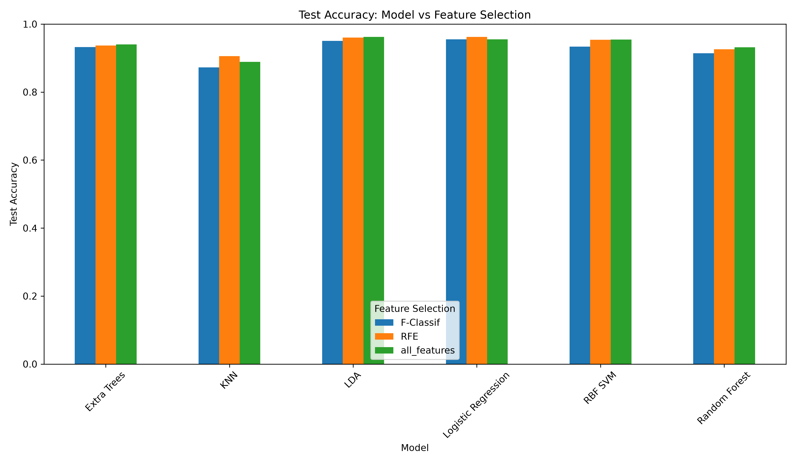
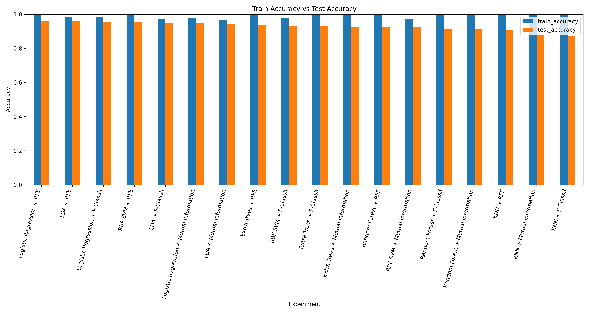
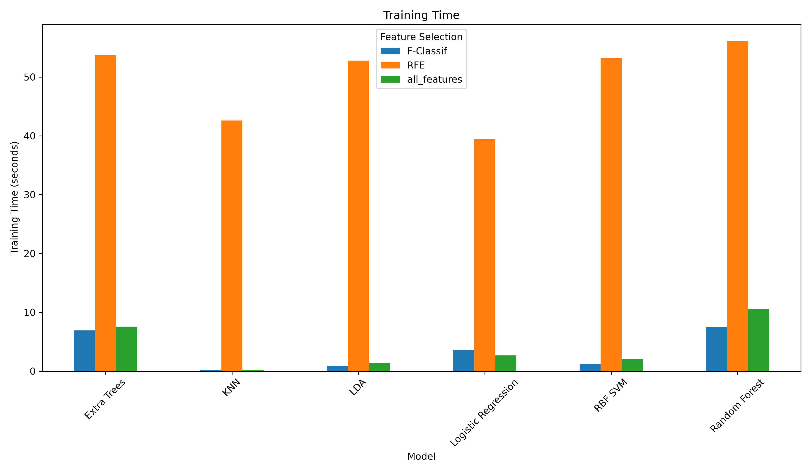

# Human Activity Recognition — Results Report

**Source:** `results/evaluation/`  
**Experiments evaluated:** 18  
**Report scope:** all CSV summaries and generated evaluation plots currently stored in the evaluation folder.

## 1. Executive summary

The evaluation compares six classifiers across three feature-selection conditions. The highest test accuracy is **96.23%**, achieved by two configurations:

1. LDA with `all_features`
2. Logistic Regression with `RFE`

The Logistic Regression + RFE run is the recorded best configuration in the experiment output because it appears first in the maximum-accuracy selection. LDA with `all_features` has the smaller train-test accuracy gap (**2.34 percentage points** versus **3.10 percentage points**), while Logistic Regression + RFE requires substantially more training time.

Across all 18 runs, the mean train accuracy is **99.38%**, mean test accuracy is **93.53%**, and mean train-test gap is **5.84 percentage points**.

## 2. Evaluation inputs and outputs

This report uses every file in `results/evaluation/`:

| File | Purpose |
|---|---|
| `all_results.csv` | Complete 18-row result set, including metrics, timings, and classification reports |
| `top_experiments.csv` | Ten experiments ranked by test accuracy |
| `model_comparison.csv` | Average and best performance grouped by model |
| `feature_selection_comparison.csv` | Average and best performance grouped by feature condition |
| `test_accuracy.png` | Test-accuracy comparison plot |
| `train_vs_test_accuracy.png` | Train-versus-test accuracy plot for all experiments |
| `training_time.png` | Training-time comparison plot |

## 3. Best experiment

| Metric | Value |
|---|---:|
| Model | Logistic Regression |
| Feature condition | RFE |
| Selected features | 350 |
| Train accuracy | 99.33% |
| Test accuracy | 96.23% |
| Accuracy gap | 3.10 percentage points |
| Training time | 39.45 seconds |
| Test prediction time | 0.032 seconds |

The tied LDA + `all_features` configuration achieved the same 96.23% test accuracy with a 2.34-point accuracy gap and 1.37 seconds of training time.

## 4. Top ten experiments

The following table is taken from `top_experiments.csv`.

| Rank | Model | Feature condition | Test accuracy | Accuracy gap | Training time (s) | Test time (s) |
|---:|---|---|---:|---:|---:|---:|
| 1 | LDA | `all_features` | 96.23% | 2.34 pp | 1.37 | 0.031 |
| 2 | Logistic Regression | `RFE` | 96.23% | 3.10 pp | 39.45 | 0.032 |
| 3 | LDA | `RFE` | 96.06% | 2.07 pp | 52.79 | 0.039 |
| 4 | Logistic Regression | `all_features` | 95.52% | 4.11 pp | 2.66 | 0.032 |
| 5 | Logistic Regression | `F-Classif` | 95.52% | 2.81 pp | 3.53 | 0.037 |
| 6 | RBF SVM | `all_features` | 95.42% | 4.36 pp | 2.02 | 3.388 |
| 7 | RBF SVM | `RFE` | 95.39% | 4.38 pp | 53.24 | 1.201 |
| 8 | LDA | `F-Classif` | 95.05% | 2.29 pp | 0.91 | 0.034 |
| 9 | Extra Trees | `all_features` | 94.03% | 5.97 pp | 7.59 | 0.277 |
| 10 | Extra Trees | `RFE` | 93.69% | 6.31 pp | 53.74 | 0.195 |

## 5. Model comparison

Values below are from `model_comparison.csv` and are averages across the three feature conditions for each model.

| Model | Avg. train accuracy | Avg. test accuracy | Best test accuracy | Avg. training time (s) | Avg. test time (s) |
|---|---:|---:|---:|---:|---:|
| Logistic Regression | 99.10% | 95.76% | 96.23% | 15.21 | 0.033 |
| LDA | 98.01% | 95.78% | 96.23% | 18.36 | 0.035 |
| RBF SVM | 99.16% | 94.72% | 95.42% | 18.83 | 1.845 |
| Extra Trees | 99.99% | 93.64% | 94.03% | 22.74 | 0.219 |
| Random Forest | 100.00% | 92.40% | 93.15% | 24.73 | 0.165 |
| KNN | 100.00% | 88.90% | 90.57% | 14.31 | 0.237 |

Logistic Regression and LDA provide the strongest average generalization. Tree ensembles and KNN show very high training accuracy but lower test accuracy, indicating greater overfitting in this evaluation.

## 6. Feature-selection comparison

Values below are from `feature_selection_comparison.csv` and are averages across the six classifiers.

| Feature condition | Avg. train accuracy | Avg. test accuracy | Best test accuracy | Avg. training time (s) |
|---|---:|---:|---:|---:|
| RFE | 99.54% | 94.09% | 96.23% | 49.66 |
| `all_features` | 99.66% | 93.88% | 96.23% | 4.06 |
| `F-Classif` | 98.93% | 92.64% | 95.52% | 3.37 |

RFE produces the highest average and best test performance, but it is much more expensive to train. The current runner passes `k=350` to every selector, so the `all_features` label represents the current implementation condition rather than an actual 561-feature no-selection baseline.

## 7. Visual evaluation

### Test accuracy



This plot compares test accuracy for each model across the three feature conditions. The strongest results are the LDA and Logistic Regression configurations at approximately 96%.

### Train versus test accuracy



This plot makes the generalization gap visible. KNN, Random Forest, and Extra Trees reach near-perfect training accuracy while achieving materially lower test accuracy.

### Training time



RFE runs take substantially longer than the other feature conditions because recursive elimination repeatedly fits its estimator. RBF SVM has the highest average test-prediction time in the model comparison.

## 8. Interpretation

- **Best accuracy:** LDA + `all_features` and Logistic Regression + RFE tie at 96.23%.
- **Best balance of accuracy and training cost:** LDA + `all_features` is the practical choice among the tied leaders because it trains in about 1.37 seconds and has the smaller accuracy gap.
- **Best average feature condition:** RFE, although its average training time is about 49.66 seconds.
- **Most efficient strong baseline:** Logistic Regression with `all_features` or `F-Classif` offers about 95.52% test accuracy with low single-digit training time.
- **Main risk:** The gap between near-perfect training accuracy and lower test accuracy for KNN and tree ensembles suggests overfitting.

## 9. Reproducibility

Regenerate the evaluation artifacts from the repository root with:

```bash
python main.py
```

To regenerate only the reports and plots from the existing experiment CSV:

```bash
python -c "from evaluation import evaluation; evaluation()"
```

The complete per-experiment metrics and per-class classification reports remain available in `results/evaluation/all_results.csv`.
